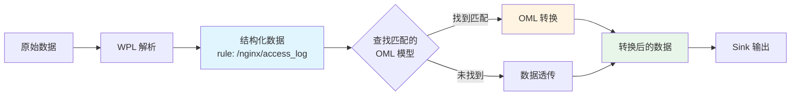

# OML 集成指南

本文档介绍如何将 OML 集成到数据处理流水线中，包括配置关联、数据流向和路由规则。

## 目录

- [数据流概览](#数据流概览)
- [OML 在数据流中的位置](#oml-在数据流中的位置)
- [配置文件结构](#配置文件结构)
- [OML 与 Sink 关联](#oml-与-sink-关联)
- [路由规则](#路由规则)
- [配置示例](#配置示例)
- [工作流程](#工作流程)
- [最佳实践](#最佳实践)
- [故障排查](#故障排查)

---

## 数据流概览

在 WP Engine 数据处理流水线中，数据的完整流向如下：

```
原始日志/数据
    ↓
[WPL 解析]
    ↓
结构化数据（携带 Rule 标识）
    ↓
[OML 转换]（可选）
    ↓
目标格式数据
    ↓
[Sink 输出]
    ↓
目标存储（文件/数据库/消息队列等）
```

### 关键概念

- **WPL Rule**：标识数据来源和类型的路径，如 `/nginx/access_log`
- **OML Model**：定义数据转换逻辑的 OML 配置文件
- **Sink Group**：输出组，定义数据的输出目标集合
- **Connector**：连接器，定义具体的输出方式（文件、Kafka、数据库等）

---

## OML 在数据流中的位置

OML 作为**数据转换引擎**，位于 WPL 解析和 Sink 输出之间：



**工作原理**：

1. WPL 解析器处理原始数据，生成结构化数据并附带 Rule 标识
2. 系统根据 Sink Group 配置查找匹配的 OML 模型
3. 如果找到匹配的 OML 模型，执行转换；否则数据透传
4. 转换后的数据发送到 Sink 进行输出

---

## 配置文件结构

### 项目目录结构

```
project/
├── oml/                        # OML 模型目录
│   ├── nginx_access.oml        # Nginx 访问日志转换
│   ├── nginx_error.oml         # Nginx 错误日志转换
│   └── system_metrics.oml      # 系统监控数据转换
├── topology/
│   └── sinks/                  # Sink 配置目录
│       ├── web_logs.toml       # Web 日志输出组
│       └── metrics.toml        # 监控数据输出组
└── connectors/                 # 连接器定义
    ├── file_sink.toml
    ├── kafka_sink.toml
    └── mysql_sink.toml
```

### OML 模型文件

OML 模型文件位于 `oml/` 目录，使用 `.oml` 扩展名。

**文件格式**：

```oml
name : <模型名称>
rule : <WPL 规则模式>
---
<字段转换定义>
```

**示例**：`oml/nginx_access.oml`

```oml
name : nginx_access
rule : /nginx/access*
---
user_id = read(user_id) ;
timestamp : time = read(time) ;
status : digit = read(status_code) ;
uri = read(request_uri) ;

# 创建结构化输出
log : obj = object {
    user : chars = read(user_id) ;
    time : time = read(timestamp) ;
    status : digit = read(status) ;
    uri : chars = read(uri) ;
} ;
```

### Sink Group 配置文件

Sink Group 配置文件位于 `topology/sinks/` 目录，使用 TOML 格式。

**文件格式**：

```toml
version = "2.0"

[sink_group]
name = "输出组名称"
oml = ["<OML 模型名称>", ...]  # 关联的 OML 模型
rule = ["<WPL 规则模式>", ...]  # 可选：限定处理的规则
parallel = 1                     # 可选：并行度
tags = ["key:value", ...]        # 可选：标签

[[sink_group.sinks]]
name = "输出目标名称"
connect = "<连接器 ID>"
tags = ["key:value", ...]

[sink_group.sinks.params]
# 连接器特定的参数
```

**示例**：`topology/sinks/web_logs.toml`

```toml
version = "2.0"

[sink_group]
name = "web_logs"
oml = ["*"]           # 使用所有匹配的 OML 模型
rule = []             # 不限定规则
parallel = 1

[[sink_group.sinks]]
name = "access_logs"
connect = "file_json_sink"

[sink_group.sinks.params]
file = "access.json"

[[sink_group.sinks]]
name = "error_logs"
connect = "file_json_sink"

[sink_group.sinks.params]
file = "error.json"
```

---

## OML 与 Sink 关联

### 关联方式

Sink Group 通过 `oml` 字段与 OML 模型建立关联，支持三种模式：

#### 1. 通配符模式（推荐）

使用 `["*"]` 自动匹配所有符合条件的 OML 模型。

```toml
[sink_group]
name = "all_logs"
oml = ["*"]  # 自动匹配所有 OML 模型
```

**工作原理**：
1. 数据携带 WPL Rule（如 `/nginx/access_log`）
2. 系统遍历所有 OML 模型
3. 找到 `rule` 字段匹配的 OML 模型
4. 执行转换

**适用场景**：
- 需要处理多种类型的数据
- OML 模型经常变动
- 希望自动发现新的 OML 模型

#### 2. 指定模型名称

明确列出需要使用的 OML 模型。

```toml
[sink_group]
name = "nginx_logs"
oml = ["nginx_access", "nginx_error"]
```

**工作原理**：
- 只在指定的 OML 模型列表中查找匹配
- 其他 OML 模型会被忽略

**适用场景**：
- 明确知道需要哪些 OML 模型
- 需要精确控制转换逻辑
- 避免意外使用其他 OML 模型

#### 3. 空列表（数据透传）

不使用任何 OML 转换，数据直接输出。

```toml
[sink_group]
name = "raw_logs"
oml = []  # 不使用 OML 转换
```

**适用场景**：
- 不需要数据转换
- 直接输出 WPL 解析后的原始数据

---

## 路由规则

### OML 模型匹配规则

OML 模型通过 `rule` 字段定义匹配的 WPL Rule 模式，支持通配符。

**匹配逻辑**：

```
数据的 WPL Rule 是否匹配 OML 模型的 rule 字段
```

**通配符规则**：
- `*` 匹配任意字符（包括 `/`）
- 支持前缀匹配、后缀匹配、完全匹配

**示例**：

| OML rule 字段 | 数据 WPL Rule | 是否匹配 |
|---------------|--------------|---------|
| `/nginx/*` | `/nginx/access_log` | ✅ 匹配 |
| `/nginx/*` | `/nginx/error_log` | ✅ 匹配 |
| `/nginx/access*` | `/nginx/access_log` | ✅ 匹配 |
| `/nginx/access*` | `/nginx/error_log` | ❌ 不匹配 |
| `*` | 任意规则 | ✅ 匹配 |
| `/apache/*` | `/nginx/access_log` | ❌ 不匹配 |

### Sink Group 规则过滤

Sink Group 可以通过 `rule` 字段进一步限定处理的数据。

```toml
[sink_group]
name = "filtered_logs"
oml = ["*"]
rule = ["/nginx/*", "/apache/*"]  # 只处理 Nginx 和 Apache 日志
```

**工作流程**：

```
1. 数据的 WPL Rule 是否匹配 Sink Group 的 rule？
   ├─ 是 → 继续
   └─ 否 → 跳过此 Sink Group

2. 查找匹配的 OML 模型
   ├─ 找到 → 执行转换
   └─ 未找到 → 数据透传（如果 oml=["*"] 或 oml=[]）

3. 输出到 Sink
```

---

## 配置示例

### 示例 1：基础配置

处理 Nginx 访问日志并输出到文件。

**OML 模型**：`oml/nginx_access.oml`

```oml
name : nginx_access
rule : /nginx/access_log
---
user_id = read(user_id) ;
timestamp : time = read(time) ;
status : digit = read(status_code) ;
uri = read(request_uri) ;

access_log : obj = object {
    user : chars = read(user_id) ;
    time : time = read(timestamp) ;
    status : digit = read(status) ;
    uri : chars = read(uri) ;
} ;
```

**Sink Group 配置**：`topology/sinks/nginx_logs.toml`

```toml
version = "2.0"

[sink_group]
name = "nginx_access_logs"
oml = ["nginx_access"]

[[sink_group.sinks]]
name = "file_output"
connect = "file_json_sink"

[sink_group.sinks.params]
file = "nginx_access.json"
```

---

### 示例 2：多 OML 模型配置

处理多种类型的日志。

**OML 模型 1**：`oml/nginx_access.oml`

```oml
name : nginx_access
rule : /nginx/access*
---
user_id = read(user_id) ;
uri = read(request_uri) ;
status : digit = read(status_code) ;
```

**OML 模型 2**：`oml/apache_access.oml`

```oml
name : apache_access
rule : /apache/access*
---
user = read(remote_user) ;
path = read(request) ;
code : digit = read(status) ;
```

**Sink Group 配置**：`topology/sinks/web_logs.toml`

```toml
version = "2.0"

[sink_group]
name = "all_web_logs"
oml = ["*"]  # 自动匹配所有 OML 模型

[[sink_group.sinks]]
name = "unified_output"
connect = "file_json_sink"

[sink_group.sinks.params]
file = "web_logs.json"
```

---

### 示例 3：条件路由

根据数据类型输出到不同目标。

**Sink Group 1**：`topology/sinks/error_logs.toml`

```toml
version = "2.0"

[sink_group]
name = "error_logs"
oml = ["*"]
rule = ["*/error*"]  # 只处理错误日志

[[sink_group.sinks]]
name = "error_file"
connect = "file_json_sink"

[sink_group.sinks.params]
file = "errors.json"
```

**Sink Group 2**：`topology/sinks/access_logs.toml`

```toml
version = "2.0"

[sink_group]
name = "access_logs"
oml = ["*"]
rule = ["*/access*"]  # 只处理访问日志

[[sink_group.sinks]]
name = "access_file"
connect = "file_json_sink"

[sink_group.sinks.params]
file = "access.json"
```

---

### 示例 4：数据富化（SQL 集成）

从数据库查询额外信息。

**OML 模型**：`oml/user_activity.oml`

```oml
name : user_activity
rule : /app/user_activity
---
user_id = read(user_id) ;
action = read(action) ;
timestamp : time = Now::time() ;

# 从数据库查询用户信息
user_name, user_level =
    select name, level
    from users
    where id = read(user_id) ;

# 聚合输出
activity : obj = object {
    user : obj = object {
        id : chars = read(user_id) ;
        name : chars = read(user_name) ;
        level : chars = read(user_level) ;
    } ;
    action : chars = read(action) ;
    time : time = read(timestamp) ;
} ;
```

**Sink Group 配置**：`topology/sinks/user_activities.toml`

```toml
version = "2.0"

[sink_group]
name = "user_activities"
oml = ["user_activity"]

[[sink_group.sinks]]
name = "kafka_output"
connect = "kafka_sink"

[sink_group.sinks.params]
topic = "user-activities"
brokers = ["localhost:9092"]
```

---

## 工作流程

### 完整处理流程

```
1. 数据到达
   ↓
2. WPL 解析
   ├─ 生成结构化数据
   └─ 附加 Rule 标识（如 /nginx/access_log）
   ↓
3. Sink Group 匹配
   ├─ 检查 Sink Group 的 rule 字段
   └─ 匹配 → 继续；不匹配 → 跳过
   ↓
4. OML 模型查找
   ├─ 根据 Sink Group 的 oml 字段
   ├─ 查找匹配的 OML 模型
   └─ 找到 → 转换；未找到 → 透传
   ↓
5. 数据转换（如果有 OML）
   ├─ 执行 OML 转换逻辑
   └─ 生成目标格式数据
   ↓
6. Sink 输出
   ├─ 根据 Connector 配置
   └─ 输出到目标存储
```

### 多 Sink Group 并行处理

一条数据可以被多个 Sink Group 同时处理：

```
                数据（rule: /nginx/access_log）
                        |
        +---------------+---------------+
        |                               |
    Sink Group 1                   Sink Group 2
    (rule: ["/nginx/*"])          (rule: ["/nginx/access*"])
        |                               |
    OML 转换 A                      OML 转换 B
        |                               |
    输出到文件                       输出到 Kafka
```

---

## 最佳实践

### 1. OML 模型命名

使用清晰的命名规则：

```
<数据源>_<数据类型>.oml

示例：
- nginx_access.oml
- apache_error.oml
- system_metrics.oml
```

### 2. Rule 模式设计

使用有意义的层次结构：

```oml
# 好的示例
rule : /nginx/access_log
rule : /apache/access_log
rule : /system/cpu_metrics

# 避免过于宽泛
rule : *  # 会匹配所有数据
```

### 3. Sink Group 组织

按业务逻辑组织 Sink Group：

```
topology/sinks/
├── web_logs.toml           # Web 日志
├── system_metrics.toml     # 系统监控
├── application_logs.toml   # 应用日志
└── security_events.toml    # 安全事件
```

### 4. 使用通配符模式

对于灵活的配置，推荐使用通配符：

```toml
[sink_group]
oml = ["*"]  # 自动发现所有 OML 模型
```

### 5. 数据透传场景

不需要转换时，明确使用空列表：

```toml
[sink_group]
oml = []  # 明确表示不使用 OML
```

### 6. 测试配置

在部署前测试配置：

1. 验证 OML 语法
2. 检查 Rule 匹配逻辑
3. 确认 Sink 连接
4. 测试数据流向

---

## 故障排查

### 问题 1：数据未经过 OML 转换

**可能原因**：
- OML 模型的 `rule` 不匹配数据的 WPL Rule
- Sink Group 的 `oml` 配置错误

**排查步骤**：
1. 检查数据的 WPL Rule
2. 检查 OML 模型的 `rule` 字段
3. 验证通配符匹配逻辑
4. 检查 Sink Group 的 `oml` 配置

**示例**：
```oml
# OML 模型
rule : /nginx/access_log

# 数据 Rule
/nginx/access  # ❌ 不匹配（缺少 _log）

# 修正
rule : /nginx/access*  # ✅ 匹配
```

---

### 问题 2：数据被重复处理

**可能原因**：
- 多个 Sink Group 匹配同一数据
- 多个 OML 模型匹配同一 Rule

**排查步骤**：
1. 检查所有 Sink Group 的 `rule` 配置
2. 确认是否需要并行处理
3. 调整 Rule 模式避免重复

---

### 问题 3：OML 转换失败

**可能原因**：
- OML 语法错误
- 字段不存在
- 类型转换失败

**排查步骤**：
1. 检查 OML 语法
2. 验证输入数据结构
3. 使用默认值处理缺失字段
4. 检查类型转换逻辑

**示例**：
```oml
# 容错处理
port : digit = read(port) { _ : digit(80) } ;
user_id = read(user_id) { _ : chars(unknown) } ;
```

---

### 问题 4：Sink 输出失败

**可能原因**：
- Connector 配置错误
- 目标存储不可用
- 权限问题

**排查步骤**：
1. 检查 Connector 配置
2. 验证目标存储连接
3. 检查权限和凭证
4. 查看错误日志

---

## 下一步

- [实战指南](./03-practical-guide.md) - 查看 OML 转换示例
- [函数参考](./04-functions-reference.md) - 查阅可用函数
- [语法参考](./06-grammar-reference.md) - 查看完整语法
- [快速入门](./01-quickstart.md) - 回顾基础用法
